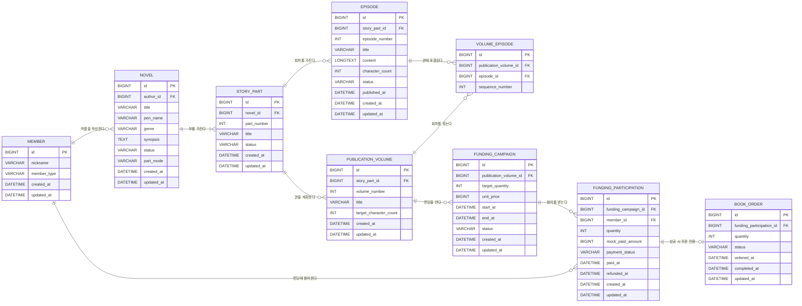

# 데이터 모델 및 ERD

> `docs/02_사용자_요구사항_정의서.md`를 기준으로 만든 1차 기준안이다. 구현 중 변경 필요성이 생기면 영향 범위를 설명하고 사용자 승인 후 이 문서와 코드를 함께 수정한다.

## 1. 모델링 기준

- 로그인은 구현하지 않지만 작품 소유자, 펀딩 참여자, 주문 소유자와 관리자 체험 역할을 구분하기 위해 최소 회원 데이터를 둔다.
- 랜딩페이지에서 선택한 시드 회원 ID와 역할은 HTTP 세션에 저장하며 별도 세션 테이블은 만들지 않는다.
- 작가는 부 묶음 사용 여부를 선택한다.
- DB에서는 부를 사용하지 않는 작품도 숨겨진 기본 부 `본편`을 자동 생성해 `작품 → 부 → 회차` 구조를 유지한다.
- 실제 책 한 `권`은 같은 부에 속한 여러 회차를 순서대로 묶는다.
- 한 부를 여러 권으로 나눌 수 있도록 권과 회차 사이에 연결 테이블을 둔다.
- 펀딩 참여 수량은 참여 데이터의 합계로 계산하며 별도 누적 컬럼을 두지 않는다.
- 펀딩 성공 건만 참여자별 책 주문으로 전환한다.
- 실제 결제·환불·PDF·인쇄·배송은 구현하지 않고 상태와 금액만 모의 처리한다.

## 2. 전체 ERD



## 3. 엔티티별 역할

### MEMBER — 회원

- 인증이 아닌 데이터 소유자 구분을 위한 최소 회원 정보다.
- `member_type`: `AUTHOR`, `READER`, `ADMIN`
- 비밀번호, 이메일과 로그인 토큰은 저장하지 않는다.
- 시드 데이터로 작가·독자·관리자를 제공하고 랜딩페이지의 체험 역할 선택 결과를 세션에 저장한다.
- 세션 역할은 데모 화면 분기용이며 실제 인증·인가 수단이 아니다.

### NOVEL — 작품

- 작품 기본 정보와 전체 연재 상태를 관리한다.
- `author_id`로 작품 소유자를 구분하고 `pen_name`은 화면에 공개할 필명이다.
- 상태: `DRAFT`, `SERIALIZING`, `COMPLETED`
- `part_mode`: `SINGLE`(부 구분 없음), `MULTI`(1부·2부 사용)

### STORY_PART — 부

- 작품을 1부·2부 같은 이야기 단위로 나눈다.
- `SINGLE` 작품은 시스템이 `1 / 본편` 부를 자동 생성하고 독자 화면에서는 부 이름을 숨긴다.
- `MULTI` 작품은 작가가 부 제목과 순서를 관리한다.
- 같은 작품 안에서 `part_number`는 중복될 수 없다.
- 상태: `DRAFT`, `SERIALIZING`, `COMPLETED`

### EPISODE — 회차

- 특정 부에 속한 웹소설 본문이다.
- 같은 부 안에서 `episode_number`는 중복될 수 없다.
- 상태: `DRAFT`, `PUBLISHED`
- 본문 저장 시 서버가 `character_count`를 다시 계산한다.

### PUBLICATION_VOLUME — 권 출판계획

- 실제 책 한 권의 번호, 제목과 목표 글자 수를 관리한다.
- 같은 부 안에서 `volume_number`는 중복될 수 없다.
- 현재 글자 수와 출판 준비 여부는 연결된 회차를 기준으로 계산한다.

### VOLUME_EPISODE — 권별 포함 회차

- 한 권에 포함할 회차와 책 안에서의 순서를 관리한다.
- 같은 권에 같은 회차를 중복 포함할 수 없다.
- 같은 부의 연속된 공개 회차만 포함하도록 Service에서 검증한다.

### FUNDING_CAMPAIGN — 소장본 펀딩

- 특정 권의 목표 수량, 모의 판매가와 펀딩 기간을 관리한다.
- 상태: `DRAFT`, `OPEN`, `SUCCESS`, `FAILED`
- 성공 조건: 목표 수량 달성 + 부/작품 완결 + 한 권 예상 분량 충족
- 한 권에 재펀딩을 열 수 있도록 권과 펀딩은 1:N 관계로 둔다.

### FUNDING_PARTICIPATION — 펀딩 참여

- 회원의 참여 수량과 모의 결제 금액을 기록한다.
- 같은 회원은 같은 펀딩에 한 번만 참여할 수 있다.
- 결제 상태: `PAID_MOCK`, `REFUNDED_MOCK`
- 펀딩 성공 시 결제 완료 상태를 유지하고 별도 주문을 생성한다.

### BOOK_ORDER — 책 주문

- 성공한 펀딩의 참여 건을 참여자별 주문으로 전환한 결과다.
- 하나의 참여 건은 최대 하나의 주문만 가질 수 있다.
- 상태: `PENDING`, `PROCESSING`, `COMPLETED`
- 실제 수령인, 주소, 송장과 배송 상태는 저장하지 않는다.

## 4. 주요 키와 제약조건

| 테이블 | 키·제약조건 |
|---|---|
| NOVEL | `author_id NOT NULL` |
| STORY_PART | `UNIQUE(novel_id, part_number)` |
| EPISODE | `UNIQUE(story_part_id, episode_number)` |
| PUBLICATION_VOLUME | `UNIQUE(story_part_id, volume_number)` |
| VOLUME_EPISODE | `UNIQUE(publication_volume_id, episode_id)`, `UNIQUE(publication_volume_id, sequence_number)` |
| FUNDING_PARTICIPATION | `UNIQUE(funding_campaign_id, member_id)` |
| BOOK_ORDER | `UNIQUE(funding_participation_id)` |
| 수량·금액·순서 | 모두 1 이상 |
| 펀딩 기간 | `start_at < end_at` |

DB 제약조건으로 표현하기 어려운 아래 규칙은 Service에서 검증한다.

- `AUTHOR` 회원만 작품을 만들 수 있다.
- `READER` 회원만 펀딩에 참여할 수 있다.
- `ADMIN` 회원만 전체 주문 상태를 변경하고 운영 통계·내보내기를 사용할 수 있다.
- 작품 생성 시 `SINGLE`이면 `1 / 본편` 부를 자동 생성한다.
- `SINGLE` 작품은 부를 하나만 가질 수 있다.
- 여러 부가 있는 작품은 `SINGLE`로 변경할 수 없다.
- 공개 회차나 펀딩이 존재하면 부 사용 방식을 변경할 수 없다.
- 권에 포함된 모든 회차는 해당 권과 같은 부에 속해야 한다.
- 권의 회차는 빠진 번호 없이 연속되어야 한다.
- 같은 부에서 서로 다른 권의 회차 범위가 겹치면 안 된다.
- 공개 회차만 펀딩 대상 권에 포함할 수 있다.

### NULL 정책

기본값은 `NOT NULL`이며 아래 세 필드만 상태상 값이 없을 수 있다.

| 필드 | NULL 허용 이유 |
|---|---|
| `EPISODE.published_at` | 초안 회차는 아직 공개 시각이 없음 |
| `FUNDING_PARTICIPATION.refunded_at` | 환불되지 않은 참여는 환불 시각이 없음 |
| `BOOK_ORDER.completed_at` | 제작 완료 전에는 완료 시각이 없음 |

- 부 사용 여부 때문에 FK를 NULL로 만들지 않는다.
- 빈 문자열은 값 없음으로 인정하지 않고 입력 검증에서 차단한다.

## 5. 조회용 인덱스

| 테이블 | 인덱스 | 사용 화면 |
|---|---|---|
| NOVEL | `(status, updated_at)` | 독자 작품 목록 |
| NOVEL | `(author_id, updated_at)` | 작가 작품 관리 |
| STORY_PART | `(novel_id, part_number)` | 작품 상세 |
| EPISODE | `(story_part_id, episode_number)` | 회차 목록·읽기 |
| FUNDING_CAMPAIGN | `(status, end_at)` | 진행 중 펀딩 목록 |
| FUNDING_PARTICIPATION | `(member_id, created_at)` | 내 펀딩 |
| BOOK_ORDER | `(status, ordered_at)` | 관리자 주문 관리·통계·내보내기 |

## 6. 계산 값

### 회차 글자 수

- 본문은 HTML이 아닌 일반 텍스트로 저장한다.
- 공백은 포함하고 줄바꿈 문자는 제외한 Unicode 글자 수를 서버에서 계산한다.
- 수정 시 `character_count`를 다시 계산해 저장한다.

### 한 권 예상 분량

```text
현재 글자 수 = 권에 포함된 회차 character_count 합계
예상 분량 달성률 = 현재 글자 수 / target_character_count × 100
```

- 달성률 100% 이상이어야 펀딩 성공 조건을 충족한다.
- 실제 페이지 수는 글꼴·판형·조판에 따라 달라지므로 예상 글자 수만 제공한다.

### 펀딩 달성 수량

```text
현재 펀딩 수량 = PAID_MOCK 상태 참여 건의 quantity 합계
펀딩 달성률 = 현재 펀딩 수량 / target_quantity × 100
```

- `REFUNDED_MOCK` 상태의 참여 수량은 제외한다.
- `mock_paid_amount = unit_price × quantity`로 서버에서 계산한다.

## 7. 상태 전이

### 작품·부

```text
DRAFT → SERIALIZING → COMPLETED
```

### 회차

```text
DRAFT → PUBLISHED
```

### 펀딩

```text
DRAFT → OPEN → SUCCESS
             └→ FAILED
```

### 모의 결제

```text
PAID_MOCK → REFUNDED_MOCK
```

- 펀딩 성공 시 `PAID_MOCK`을 유지하고 주문을 생성한다.

### 주문

```text
PENDING → PROCESSING → COMPLETED
```

## 8. 삭제 정책

- 펀딩이 연결되지 않은 초안 작품·부·회차·권 출판계획만 삭제할 수 있다.
- 펀딩 참여나 주문이 존재하면 이력 보존을 위해 삭제하지 않고 상태로 관리한다.
- FK에는 무조건적인 연쇄 삭제를 설정하지 않는다.
- 회원은 실제 탈퇴 기능이 없으므로 삭제하지 않는다.

## 9. JPA 매핑 원칙

- 자식 엔티티가 `@ManyToOne(fetch = LAZY)`로 FK를 소유한다.
- 부모 컬렉션은 화면 조회를 위해 무조건 순회하지 않고 Repository DTO 조회를 사용한다.
- 열거형은 `EnumType.STRING`으로 저장한다.
- 엔티티를 Thymeleaf에 직접 전달하지 않고 요청·응답 DTO로 분리한다.
- 상태 변경, 펀딩 판정, 모의 환불과 주문 생성은 Service 트랜잭션에서 처리한다.
- DB 전체 연쇄 삭제를 유발하는 `CascadeType.ALL`은 기본값으로 사용하지 않는다.
- 글자 수, 모의 결제 금액과 펀딩 달성 수량은 클라이언트 값을 신뢰하지 않고 서버에서 계산한다.

## 10. 핵심 트랜잭션

### 펀딩 참여

1. 펀딩이 `OPEN`이고 현재 시간이 기간 안인지 확인
2. 회원의 중복 참여 여부 확인
3. 서버에서 모의 결제 금액 계산
4. `PAID_MOCK` 참여 저장

### 펀딩 마감

1. 목표 수량, 부/작품 완결과 권 예상 분량 확인
2. 성공이면 펀딩을 `SUCCESS`로 변경
3. 참여자마다 `PENDING` 주문 생성
4. 실패면 펀딩을 `FAILED`로 변경하고 참여를 `REFUNDED_MOCK`으로 변경

### 주문 상태 변경

1. 세션의 체험 역할이 `ADMIN`인지 확인
2. 현재 상태와 요청 상태의 순서 검증
3. `PENDING → PROCESSING → COMPLETED`만 허용
4. 완료 시각 기록

## 11. 현재 확정한 범위

- 작품의 여러 부 지원
- 작가가 부 구분 사용 여부를 선택
- 부 구분이 없으면 숨겨진 기본 부 `본편` 자동 생성
- 한 부의 여러 권 분할 지원
- 권별 회차 선택과 순서 관리
- 공백 포함·줄바꿈 제외 글자 수 계산
- 펀딩 성공 시 참여자마다 주문 1건 생성
- 회원가입·로그인 없이 시드 회원과 세션으로 독자·작가·관리자 체험 역할 및 소유권 구분
- 관리자 주문 상태 관리, 운영 통계와 주문 CSV·JSON 내보내기
