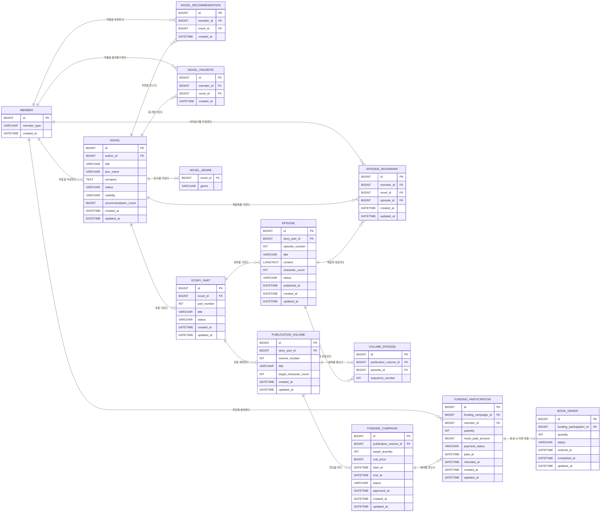

# 데이터 모델 및 ERD

> `docs/02_사용자_요구사항_정의서.md`를 기준으로 만든 1차 기준안이다. 구현 중 변경 필요성이 생기면 영향 범위를 설명하고 사용자 승인 후 이 문서와 코드를 함께 수정한다.

## 1. 모델링 기준

- 로그인은 구현하지 않지만 작품 소유자, 펀딩 참여자, 주문 소유자와 관리자 체험 역할을 구분하기 위해 최소 회원 데이터를 둔다.
- 역할별 고정 체험 회원을 하나씩 두고 랜딩페이지에서 선택한 회원 ID·역할을 HTTP 세션에 저장하며 별도 세션 테이블은 만들지 않는다.
- `역할 변경`은 세션 무효화(로그아웃)로 처리한다.
- 개발·데모 환경은 Hibernate `create-drop`과 단일 `DemoDataInitializer`로 현재 구현 범위의 데이터를 매 실행 동일하게 구성한다.
- `member_type`은 최고 권한 하나만 저장하고 `READER < AUTHOR < ADMIN` 순서로 하위 기능을 포함한다.
- 회원 ID는 데이터 소유권, 역할은 기능 접근 범위로 분리한다. 역할만으로는 작성자를 식별할 수 없다.
- 모든 역할은 동일한 공개 콘텐츠 원본(NOVEL·EPISODE 등)을 조회하며 역할별 복제 테이블을 두지 않는다.
- 닉네임 컬럼은 두지 않는다. 로그인·프로필 기능이 없고 작품의 `pen_name`으로 공개 필명을 충분하게 표현하기 때문이다.
- 작가는 부 묶음 사용 여부를 선택한다.
- DB에서는 부를 사용하지 않는 작품도 숨겨진 기본 부 `본편`을 자동 생성해 `작품 → 부 → 회차` 구조를 유지한다.
- 실제 책 한 `권`은 부 하나와 1:1로 대응하며, 해당 부의 전체 회차를 수록 범위로 사용한다.
- 한 부 안에서 다시 여러 권으로 나누지 않는다. 길면 새 부를 추가한다.
- 펀딩 참여 수량은 참여 데이터의 합계로 계산하며 별도 누적 컬럼을 두지 않는다.
- 펀딩 성공 건만 참여자별 책 주문으로 전환한다.
- 실제 결제·환불·PDF·인쇄·배송은 구현하지 않고 상태와 금액만 모의 처리한다.

## 2. 전체 ERD



## 3. 엔티티별 역할

### MEMBER — 회원

- 인증이 아닌 데이터 소유자 구분을 위한 최소 회원 정보다.
- `member_type`: 최고 권한을 나타내는 `READER`, `AUTHOR`, `ADMIN`
- 비밀번호, 이메일, 로그인 토큰, 닉네임은 저장하지 않는다.
- `UNIQUE(member_type)`으로 역할별 최대 1명을 보장하고, 앱 시작 시 역할별 1명을 목 데이터로 생성한다.
- 역할 선택에서는 미리 생성된 같은 회원을 재사용한다. 같은 실행 안에서 작품·추천 등 개인 데이터를 같은 소유자로 조회하기 위해서다.
- 세션에는 `memberId`와 역할을 저장하며, 세션 역할은 해당 MEMBER의 `member_type`과 일치해야 한다.
- 세션 역할은 데모 화면 분기용이며 실제 인증·인가 수단이 아니다.
- `AUTHOR`는 독자 기능을, `ADMIN`은 독자·작가 기능을 모두 포함한다.
- 관리자가 AUTHOR 기능을 포함하더라도, 다른 고정 AUTHOR 회원의 작품을 자동으로 수정할 수 있는 것은 아니다. 소유권은 별도 검증한다.

### NOVEL — 작품

- 작품 기본 정보, 연재 상태와 공개 여부를 관리한다.
- `author_id`로 작품 소유자를 구분하고 `pen_name`은 화면에 공개할 필명이다.
- 연재 상태: `SERIALIZING`, `COMPLETED`
- 공개 여부: `PUBLIC`, `PRIVATE` (새 작품 기본값 `PRIVATE`, 목 데이터는 두 상태를 모두 포함)
- 장르는 단일 컬럼이 아니라 `NOVEL_GENRE` 컬렉션으로 분리한다. 작품당 1~8개다.
- 권 구성 상태와 권 수 컬럼은 두지 않는다. `STORY_PART` 행 개수를 조회해 1개면 한 권, 2개 이상이면 여러 권으로 표시한다.
- `recommendation_count`: 추천순 조회용 비정규화 카운트다. 추천 토글 시 작품 수정일과 분리된 bulk update로 변경한다.

### NOVEL_GENRE — 작품 장르

- `NovelGenre` enum 값만 저장한다. 임의 문자열을 차단한다.
- `(novel_id, genre)`를 유일하게 유지해 같은 장르 중복을 막는다.
- 검색은 선택 장르마다 포함 여부를 AND로 결합한다.

### NOVEL_RECOMMENDATION — 작품 추천

- 회원이 공개 작품을 추천한 기록이다.
- `(member_id, novel_id)`를 유일하게 유지해 회원당 작품별 1회만 허용한다.
- 자신의 작품 추천은 Service에서 차단한다.

### NOVEL_FAVORITE — 내 즐겨찾기

- 회원이 공개 작품을 내 즐겨찾기에 저장한 기록이다.
- `(member_id, novel_id)`를 유일하게 유지해 중복 저장을 차단한다.

### EPISODE_BOOKMARK — 이어읽기 책갈피

- 회원이 작품마다 현재 읽고 있는 회차 1개를 저장한다.
- `(member_id, novel_id)`를 유일하게 유지하고 `episode_id`를 덮어쓴다.
- 같은 회차에서 다시 저장하면 해제한다.
- 미공개 회차·작품으로 열람 권한이 없으면 이어읽기 CTA만 숨기고 행은 유지한다.
- 회차·부·작품 물리 삭제 시 관련 책갈피를 Service에서 먼저 삭제한다.

### STORY_PART — 부

- 작품을 1부·2부 같은 이야기 단위로 나누며 각 부는 소장본 한 권과 1:1로 대응한다.
- 작품 생성 시 시스템이 `1 / 본편` 권(부)을 자동 생성하고, 권(부)이 하나뿐이면 독자 화면에서 부 이름을 숨긴다.
- 권(부)이 2개 이상이면 작가가 권 단위의 제목과 순서를 관리한다.
- 같은 작품 안에서 `part_number`는 중복될 수 없다.
- 상태: `UNPUBLISHED`, `SERIALIZING`, `COMPLETED`
- 독자 화면의 부 완결 표시는 `part_number`와 `COMPLETED`를 조합해 `1부 완결`, `2부 완결`처럼 만든다.

### EPISODE — 회차

- 특정 부에 속한 웹소설 본문이다.
- 같은 부 안에서 `episode_number`는 중복될 수 없다.
- 제목에는 회차 번호를 넣지 않는다. 화면은 `episodeNumber`와 제목을 조합한다.
- 상태: `UNPUBLISHED`, `PUBLISHED`
- 목록 정렬은 `episode_number DESC`(최신화 상단).
- 본문 저장 시 서버가 `character_count`를 다시 계산한다.

### EPISODE_COMMENT — 회차 댓글

- 회차당 댓글·대댓글(1단)을 저장한다. `parent_id`가 null이면 원댓글이다.
- 삭제는 `deleted_at` 소프트 삭제. 부모 삭제 시 답글은 유지하고 화면에는 `삭제된 댓글입니다.`를 표시한다.
- 댓글 수 집계는 `deleted_at is null`만 포함한다.

### PUBLICATION_VOLUME — 권 출판계획

- 부(1권)의 목표 글자 수와 펀딩 대상 권을 관리한다.
- 각 부는 기본 권 1개와 대응하며, 현재 글자 수는 해당 부 회차의 `character_count` 합계로 계산한다.

### VOLUME_EPISODE — 권별 포함 회차

- 초기 ERD에서는 권-회차 연결을 별도 테이블로 두었으나, 현재 정책은 부 전체 회차=1권이므로 펀딩 구현 시 부 단위로 단순화할 수 있다.
- 같은 권에 같은 회차를 중복 포함할 수 없다.

### FUNDING_CAMPAIGN — 소장본 펀딩

- 특정 부(1권=1부 출판 단위)의 목표 **부수**, 모의 판매가와 펀딩 기간을 관리한다. `StoryPart`에 직접 연결한다.
- 상태: `OPEN`, `SUCCESS`, `FAILED` (UI는 OPEN 직행. DRAFT 초안 경로는 쓰지 않음)
- `approved_at`: 운영자 승인 시각. 마감 직후는 승인 대기이며, 승인 시에만 주문 생성 또는 모의 환불.
- `target_quantity`: 목표 부수(최소 10). `current_quantity`는 참여 합으로 갱신·표시한다.
- 홈에는 `OPEN`이면서 기간 내·공개 작품인 캠페인을 최신순 최대 5건 노출한다.
- 작가 OPEN·수정·취소·마감과 독자 참여·내 펀딩·주문·운영자 승인·대시보드까지 구현. Lv1~3 완료. OPEN 중 삭제만 잠금·기본 다크 테마 등 제출 정리(2026-08-02).
- 한 부에 OPEN은 동시에 1개. 종료 후 재개설 가능. 작품당 동시 OPEN 상한은 두지 않음(취소/불필요).

### FUNDING_PARTICIPATION — 펀딩 참여

- 회원의 참여 수량과 모의 결제 금액을 기록한다.
- 같은 회원은 같은 펀딩에 한 번만 참여할 수 있다.
- 결제 상태: `PAID_MOCK`, `REFUNDED_MOCK`
- 펀딩 성공 시 결제 완료 상태를 유지하고 별도 주문을 생성한다.

### BOOK_ORDER — 책 주문

- 성공한 펀딩의 참여 건을 참여자별 주문으로 전환한 결과다.
- 하나의 참여 건은 최대 하나의 주문만 가질 수 있다.
- 상태: `PENDING`, `PROCESSING`, `PRODUCTION_DONE`, `SHIP_READY`, `SHIPPING`, `DELIVERED` (표시: 접수→제작중→제작완료→배송준비중→배송중→배송완료)
- 실제 수령인, 주소, 송장 번호는 저장하지 않는다. 배송 단계는 출판 상태 모의다.

## 4. 주요 키와 제약조건

| 테이블 | 키·제약조건 |
|---|---|
| MEMBER | `UNIQUE(member_type)` — 역할별 고정 체험 회원 1명 |
| NOVEL | `author_id NOT NULL` |
| NOVEL_GENRE | `UNIQUE(novel_id, genre)`, 작품당 1~8행(Service) |
| NOVEL_RECOMMENDATION | `UNIQUE(member_id, novel_id)` |
| NOVEL_FAVORITE | `UNIQUE(member_id, novel_id)` |
| EPISODE_BOOKMARK | `UNIQUE(member_id, novel_id)`, `episode_id NOT NULL` |
| STORY_PART | `UNIQUE(novel_id, part_number)` |
| EPISODE | `UNIQUE(story_part_id, episode_number)` |
| PUBLICATION_VOLUME | `UNIQUE(story_part_id, volume_number)` |
| VOLUME_EPISODE | `UNIQUE(publication_volume_id, episode_id)`, `UNIQUE(publication_volume_id, sequence_number)` |
| FUNDING_PARTICIPATION | `UNIQUE(funding_campaign_id, member_id)` |
| BOOK_ORDER | `UNIQUE(funding_participation_id)` |
| 수량·금액·순서 | 모두 1 이상 |
| 펀딩 기간 | `start_at < end_at` |

DB 제약조건으로 표현하기 어려운 아래 규칙은 Service에서 검증한다.

- `AUTHOR`와 `ADMIN` 회원은 작품을 만들 수 있다.
- 모든 회원은 독자 기능으로 펀딩에 참여할 수 있다.
- `ADMIN` 회원만 전체 주문 상태를 변경하고 운영 통계·내보내기를 사용할 수 있다.
- 공개 콘텐츠 조회는 역할별 복제 없이 동일 원본을 반환한다. `NOVEL.visibility=PRIVATE`는 소유자와 관리자만 조회하고, `EPISODE.UNPUBLISHED`는 공개하지 않는다.
- 추천과 내 즐겨찾기는 `NOVEL.visibility=PUBLIC`인 작품에만 허용하고, 자신의 작품 추천은 차단한다.
- 장르 검색은 선택 장르를 모두 포함한 작품만 반환한다(AND).
- 책갈피 저장은 회차 열람 권한과 동일하게 검증한다. 물리 삭제 시에만 책갈피를 정리한다.
- 작품 수정·삭제는 `novel.id + novel.author_id == session.memberId`로 소유권을 검증한다. 관리자도 타 작가 작품은 수정하지 못한다.
- 부·회차·권·펀딩 변경은 상위 `NOVEL.author_id`까지 조인해 같은 소유권 규칙을 적용한다.
- AUTHOR 권한만으로 다른 작가의 리소스를 수정할 수 없다.
- 작품 생성 시 `1 / 본편` 권(부)을 자동 생성한다.
- 별도 `part_mode`와 권 수 컬럼 없이 `STORY_PART` 행 개수로 한 권/여러 권 표시를 계산한다.
- 2권 이후에 회차가 있으면 해당 추가 권을 삭제할 수 없다. 먼저 회차를 명시적으로 정리해야 한다.
- 각 부의 전체 회차가 해당 권의 수록 범위다.
- 펀딩 연결 전 소유 작가는 부·회차 상태 왕복·수정·삭제가 가능하며, 삭제 시 번호를 재정렬한다.
- 공개 회차만 독자 열람과 펀딩 대상에 포함한다.

### NULL 정책

기본값은 `NOT NULL`이며 아래 세 필드만 상태상 값이 없을 수 있다.

| 필드 | NULL 허용 이유 |
|---|---|
| `EPISODE.published_at` | 미공개 회차는 아직 공개 시각이 없음 |
| `FUNDING_PARTICIPATION.refunded_at` | 환불되지 않은 참여는 환불 시각이 없음 |
| `BOOK_ORDER.completed_at` | 배송완료 전에는 완료 시각이 없음 |

- 부 사용 여부 때문에 FK를 NULL로 만들지 않는다.
- 빈 문자열은 값 없음으로 인정하지 않고 입력 검증에서 차단한다.

## 5. 조회용 인덱스

| 테이블 | 인덱스 | 사용 화면 |
|---|---|---|
| NOVEL | `(status, updated_at)` | 독자 작품 목록 |
| NOVEL | `(author_id, updated_at)` | 작가 작품 관리 |
| NOVEL_GENRE | `UNIQUE(novel_id, genre)` | 다중 장르 AND 검색 |
| NOVEL_RECOMMENDATION | `UNIQUE(member_id, novel_id)` | 추천 토글·추천 여부 조회 |
| NOVEL_FAVORITE | `UNIQUE(member_id, novel_id)` | 내 즐겨찾기 토글·목록 조회 |
| EPISODE_BOOKMARK | `UNIQUE(member_id, novel_id)` | 이어읽기 저장·조회 |
| STORY_PART | `(novel_id, part_number)` | 작품 상세 |
| EPISODE | `(story_part_id, episode_number)` | 회차 목록·읽기 |
| FUNDING_CAMPAIGN | `(status, end_at)` | 펀딩 중(OPEN) 목록 |
| FUNDING_PARTICIPATION | `(member_id, created_at)` | 내 펀딩 |
| BOOK_ORDER | `(status, ordered_at)` | 관리자 주문 관리·통계·내보내기 |

## 6. 계산 값

### 회차 글자 수

- 본문은 HTML이 아닌 일반 텍스트로 저장한다.
- 공백은 포함하고 줄바꿈 문자는 제외한 Unicode 글자 수를 서버에서 계산한다.
- 수정 시 `character_count`를 다시 계산해 저장한다.

### 한 권 예상 분량

```text
현재 글자 수 = 권에 포함된 회차 character_count 합계
예상 분량 달성률 = 현재 글자 수 / target_character_count × 100
```

- 달성률 100% 이상이어야 펀딩 성공 조건을 충족한다.
- 실제 페이지 수는 글꼴·판형·조판에 따라 달라지므로 예상 글자 수만 제공한다.

### 펀딩 달성 수량

```text
현재 펀딩 수량 = PAID_MOCK 상태 참여 건의 quantity 합계
펀딩 달성률 = 현재 펀딩 수량 / target_quantity × 100
```

- `REFUNDED_MOCK` 상태의 참여 수량은 제외한다.
- `mock_paid_amount = unit_price × quantity`로 서버에서 계산한다.

## 7. 상태 전이

### 작품

```text
SERIALIZING → COMPLETED
PUBLIC / PRIVATE (공개 여부, 연재 상태와 별도)
```

### 부

```text
UNPUBLISHED → SERIALIZING → COMPLETED
```

### 회차

```text
UNPUBLISHED ↔ PUBLISHED
```

### 펀딩

```text
OPEN → SUCCESS
     └→ FAILED
```

- UI는 OPEN 직행(DRAFT 초안 경로 없음). 취소 시 OPEN 종료 후 같은 부 재개설 가능.
### 모의 결제

```text
PAID_MOCK → REFUNDED_MOCK
```

- 펀딩 성공 시 `PAID_MOCK`을 유지하고 주문을 생성한다.

### 주문

```text
PENDING → PROCESSING → PRODUCTION_DONE → SHIP_READY → SHIPPING → DELIVERED
```

## 8. 삭제 정책

- 펀딩 연결 전에는 소유 작가가 작품·부·회차를 삭제할 수 있다. 펀딩이 연결되면 이력 보존을 위해 삭제를 제한한다.
- **OPEN 중**에는 해당 부·회차의 **삭제**만 막는다(작성·수정·공개/비공개·회차 생성·댓글은 허용).
- 펀딩 참여나 주문이 존재하면 이력 보존을 위해 삭제하지 않고 상태로 관리한다.
- FK에는 무조건적인 연쇄 삭제를 설정하지 않는다.
- 회원은 실제 탈퇴 기능이 없으므로 삭제하지 않는다.

## 9. JPA 매핑 원칙

- 자식 엔티티가 `@ManyToOne(fetch = LAZY)`로 FK를 소유한다.
- 부모 컬렉션은 화면 조회를 위해 무조건 순회하지 않고 Repository DTO 조회를 사용한다.
- 열거형은 `EnumType.STRING`으로 저장한다.
- 엔티티를 Thymeleaf에 직접 전달하지 않고 요청·응답 DTO로 분리한다.
- 상태 변경, 펀딩 판정, 모의 환불과 주문 생성은 Service 트랜잭션에서 처리한다.
- DB 전체 연쇄 삭제를 유발하는 `CascadeType.ALL`은 기본값으로 사용하지 않는다.
- 글자 수, 모의 결제 금액과 펀딩 달성 수량은 클라이언트 값을 신뢰하지 않고 서버에서 계산한다.

## 10. 핵심 트랜잭션

### 펀딩 참여

1. 펀딩이 `OPEN`이고 현재 시간이 기간 안인지 확인
2. 회원의 중복 참여 여부 확인
3. 서버에서 모의 결제 금액 계산
4. `PAID_MOCK` 참여 저장 · `currentQuantity` 증가

### OPEN 중 환불(참여 취소)

1. 캠페인이 `OPEN`인지 확인(성공 마감 이후 불가)
2. 본인 `PAID_MOCK` 참여 건을 `REFUNDED_MOCK`으로 변경
3. `currentQuantity` 감소

### 펀딩 마감·승인

1. 작가가 마감: 목표 부수·부 완결 확인 → `SUCCESS` 또는 `FAILED` (아직 주문/환불 없음, `approved_at` null)
2. 운영자 승인: SUCCESS면 참여자마다 `PENDING` 주문, FAILED면 `REFUNDED_MOCK`
3. 운영자 거절: 캠페인을 `OPEN`으로 되돌림

### 주문 상태 변경

1. 세션의 체험 역할이 `ADMIN`인지 확인
2. 현재 상태와 요청 상태의 순서 검증
3. `PENDING → PROCESSING → PRODUCTION_DONE → SHIP_READY → SHIPPING → DELIVERED`만 허용
4. 완료(배송완료) 시각 기록

## 11. 현재 확정한 범위

- 작품의 여러 부 지원
- 작가가 부 구분 사용 여부를 선택하지 않고, 기본 부 `본편` 자동 생성 후 작품 상세에서 부 추가·삭제로 구성한다
- 부 상태 `UNPUBLISHED`는 소유자·관리자만 조회·열람에 포함된다. 독자에게는 해당 권과 그 안 회차가 미노출이다.
- 회차 공개 상태 변경은 부·작품 `SERIALIZING`/`COMPLETED`를 자동으로 바꾸지 않는다. 부 완결 저장 시에만 회차 전부 공개 여부를 검증한다.
- 한 부와 소장본 한 권의 1:1 출판 지원
- 부 전체 회차를 권 수록 범위로 사용
- 공백 포함·줄바꿈 제외 글자 수 계산
- 펀딩 성공 시 참여자마다 주문 1건 생성
- 회원가입·로그인 없이 역할별 고정 체험 회원과 세션으로 역할·소유권 구분
- 동일한 공개 콘텐츠 원본을 모든 역할이 공유
- 공개 조회와 개인 소유 데이터의 분리
- 리소스 ID와 작품 작성자 회원 ID를 결합한 소유권 검증
- 공통 플랫폼 메인과 누적 권한 메뉴
- 번호가 포함된 부 완결 표시 (`1부 완결`, `2부 완결`)
- 운영자 주문 상태 관리와 CSV·JSON 내보내기 (A-02, 캠페인 묶음 목록·상세·영수증), 펀딩 승인·CSV/JSON(`/admin/fundings`), 대시보드(`/admin`)
- 작품·부·회차·펀딩·참여·주문 시드 구현 완료. **독자·작가·운영자 Lv1~Lv3 과제 범위 완료.**
- 진행률(2026-08-01): Phase1 · Lv1 · Lv2 · Lv3 → **전체 100%**
