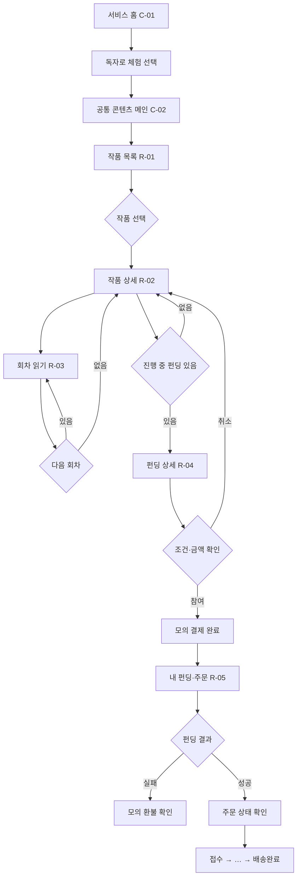
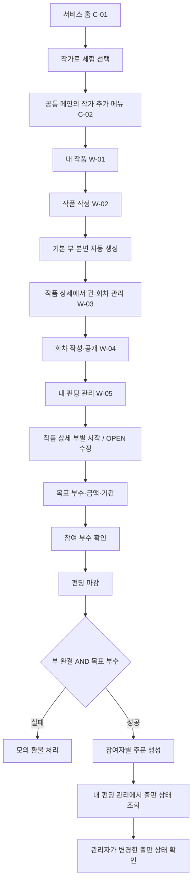
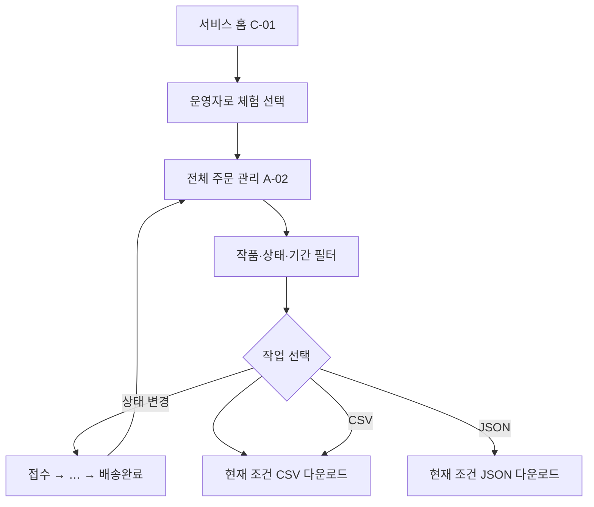

# 화면 정의서 및 사용자 흐름

> 페르소나와 사용자 요구사항을 기반으로 AI가 작성하고 사용자 검토를 반영한 화면 구현 기준안이다.

## 1. 화면 설계 원칙

- 독자 화면은 출퇴근 중 사용하는 20~30대 독자를 위해 모바일 우선으로 설계한다.
- 작가 화면은 작품·회차·펀딩을 한눈에 관리하도록 PC 화면을 우선하되 모바일에서도 깨지지 않게 한다.
- 내부 상태 코드는 그대로 노출하지 않고 `연재 중`, `1부 완결`, `2부 완결`, `제작 중`처럼 쉬운 한국어로 표시한다.
- 부 완결 문구는 고정 문자열이 아니라 `STORY_PART.part_number`와 상태를 조합해 표시한다.
- 펀딩 참여 전에 완결 조건, 목표 부수, 금액, 기한과 환불 조건을 한 화면에서 보여준다. 분량은 안내만 한다.
- 단권 작품은 기본 부 `본편`을 숨기고 회차만 표시하며, 여러 권 작품은 부 하나를 소장본 한 권으로 표시한다.
- Bootstrap 5.3.8 공식 컴포넌트를 우선 사용하고 커스텀 CSS는 본문 가독성 보정에만 최소로 사용한다.
- 사용자 선호에 따라 모든 화면 우상단에 라이트·다크 모드 전환을 제공한다. 최초 방문은 라이트 모드이고 이후 선택은 `localStorage`에 저장한다.
- 랜딩페이지는 별도로 두고 `독자 체험`, `작가 체험`, `운영자 체험` 중 하나를 선택하게 한다. 역할을 고르기 전에는 공개 콘텐츠에도 접근하지 않는다.
- 역할별 고정 체험 회원을 하나씩 두고 역할 선택 시 해당 회원 ID·역할을 세션에 저장한다. (독자·작가→`/main`, 운영자→`/admin/orders`)
- `역할 변경`은 세션을 종료하는 로그아웃으로 처리하고 랜딩페이지로 이동한다.
- 메인페이지는 독자·작가가 같은 웹소설 탐색 본문을 본다. 작가에게만 내 작품 메뉴를 추가한다.
- 운영자는 주문·펀딩 관리만 사용하며 독자·작가 메뉴에 들어가지 않는다.
- 독자는 `작가 권한 활성화 체험`으로 작가 고정 회원으로 전환할 수 있다. 작가는 독자 기능을 포함하므로 작가→독자 되돌리기 버튼은 두지 않는다.
- 독자→작가 전환은 다른 고정 체험 회원으로 세션이 바뀌므로 즐겨찾기·추천(및 향후 댓글)이 이어지지 않는다. 데이터 연속성 테스트 중에는 역할 전환을 권장하지 않는다.
- 독자 화면을 다시 보려면 `역할 변경` 후 랜딩에서 독자를 선택한다.
- 실서비스의 작가 전환에는 펀딩 피해 방지를 위한 엄격한 인증이 필요하지만, 과제에서는 체험만 제공한다.
- 권한 부족은 랜딩으로 안내하고, 다른 작가의 리소스 접근은 접근 불가 또는 404로 처리한다.
- 메인 이후의 작품·회차·펀딩·주문 등 기능 화면은 역할별 경로로 분리한다.
- 운영자 화면은 처리할 주문을 PC에서 빠르게 확인하도록 설계한다. (통계는 Lv2 보강)

## 2. 페르소나별 핵심 화면 요구

| 페르소나 | 핵심 요구 | 반영 화면 |
|---|---|---|
| W1 신인 작가 | 완결 동기를 주는 펀딩 현황 | W-01, W-05 |
| W2 독립 작가 | 인쇄·재고 없이 콘텐츠와 주문 현황 확인 | W-05, W-06 |
| W3 부 단위 장기 작가 | 여러 권 구성과 부별 출판 관리 | W-02, W-03, W-05 |
| W4 완결작 보유 작가 | 기존 완결작의 수요 검증 | W-02, W-05 |
| W5 필명 작가 | 개인정보 대신 필명 중심 노출 | W-02, R-02 |
| R1 미완결에 신중한 독자 | 완결·환불 조건의 명확한 확인 | R-02, R-04, R-05 |
| R2 소장형 독자 | 포함 회차와 권 정보 확인 | R-02, R-04 |
| R3 예산형 독자 | 금액·기한·환불 상태 확인 | R-04, R-05 |
| R4 완결 후 몰아보는 독자 | 완결 필터와 읽기 편한 본문 | R-01, R-03 |
| R5 초기 후원 독자 | 펀딩 달성률과 주문 전환 확인 | R-04, R-05 |
| R6 독자 출신 예비 작가 | 작가 권한 활성화와 첫 미공개 작품 등록 | C-01, C-02, W-02 |
| A1 서비스 운영자 | 핵심 통계, 전체 주문 처리와 자료 내보내기 | A-01, A-02 |

## 3. 전체 화면 목록

| ID | 역할 | 화면명 | 경로 | 핵심 목적 |
|---|---|---|---|---|
| C-01 | 공통 | 랜딩·역할 선택 | `/` | 서비스 설명과 독자·작가·운영자 체험 진입 |
| C-02 | 공통 | 공통 콘텐츠 메인 | `/main` | 독자·작가용 작품 탐색 메인(운영자는 미사용) |
| R-01 | 공통 | 작품 탐색 | `/novels` | 공개 작품 검색·추천·내 즐겨찾기·연재 상태 필터(AJAX 부분 갱신) |
| R-02 | 독자 | 작품 상세 | `/novels/{novelId}` | 작품 소개, 부·회차, 출판 가능한 권 확인 |
| R-03 | 독자 | 회차 읽기 | `/episodes/{episodeId}` | 모바일 중심 웹소설 본문 열람 |
| R-03A | 독자 | 내 책갈피 | `/bookmarks` | 저장한 작품별 회차 이어읽기·해제 |
| R-03B | 독자 | 회차 댓글 | `/episodes/{id}#comments` | 작성·본인 수정·소프트 삭제, 대댓글 1단 |
| R-04 | 독자 | 펀딩 상세 | `/fundings/{campaignId}` | 현황·모의 결제 참여·OPEN 중 환불. 주문/환불 상태는 R-05와 연동 |
| R-05 | 독자 | 내 펀딩·주문 | `/reader/activities` | 전체/참여 중/주문/환불 탭·테이블. 환불은 펀딩 상세 |
| W-01 | 작가 | 내 작품 관리 | `/writer/novels` | 소유 작품 검색·공개 여부·수정·삭제 |
| W-02 | 작가 | 작품 작성·수정 | `/writer/novels/new`, `/writer/novels/{id}/edit` | 기본 정보·공개 여부 |
| W-03 | 작가 | 부·회차 관리 | `/novels/{id}?from=writer` (주 동선) | 상세에서 권·회차 CRUD·일괄 공개/미공개/삭제 |
| W-04 | 작가 | 회차 작성·수정 | `/writer/parts/{partId}/episodes/new`, `/writer/episodes/{id}/edit` | 본문 작성과 글자 수 확인 |
| W-05 | 작가 | 내 펀딩 관리 | `/writer/publishing` | OPEN/SUCCESS/FAILED·출판 상태. 시작은 작품 상세 부별 |
| W-06 | 작가 | 주문 현황 | (W-05에 흡수) | 별도 `/writer/orders` 없음. SUCCESS 카드·출판 상태 배지로 조회 |
| A-01 | 운영자 | 대시보드 | `/admin` | **완료**. 핵심 통계·CSV/JSON |
| A-02 | 운영자 | 전체 주문 관리 | `/admin/orders` | 주문 조회·필터·6단계 상태·CSV/JSON |
| A-03 | 운영자 | 펀딩 관리 | `/admin/fundings` | 마감 건 승인·거절·CSV/JSON |

## 4. 공통 화면

### C-01 랜딩·역할 선택

- 구현 상태: 랜딩 화면·반응형 배치·역할 선택 Controller 완료
- 대상: 처음 방문한 독자·작가·운영자
- 핵심 문구: `완결을 기다린 독자와 끝까지 쓰는 작가를 위한 소장본 펀딩`
- 주요 구성
  - Navbar: 서비스명 `노벨킵`
  - Hero: 서비스 한 줄 설명
  - 역할 카드: `독자로 체험`, `작가로 체험`, `운영자로 체험`
  - 3단계 설명: 연재·열람 → 완결 조건부 펀딩 → 책 주문
  - 모의 기능 안내: 실제 결제·인쇄·배송이 없는 과제용 서비스
- 역할 선택 동작
  - 각 버튼은 `POST /experience/{role}`을 호출한다.
  - 서버는 선택한 역할의 고정 체험 회원을 조회하고 회원 ID·역할을 세션에 저장한다.
  - 역할 선택 후 공통 메인 경로 `/main`으로 이동한다.
- `역할 변경`은 `POST /logout`으로 세션을 종료하고 랜딩페이지로 돌아간다.
- 실제 로그인이나 보안 인증이 아닌 데모용 체험 기능임을 안내한다.
- Bootstrap: `navbar`, `container`, `row`, `card`, `btn`
- Bootstrap 5.3.8 CSS·Bundle JS는 공식 배포 파일을 앱의 로컬 정적 자원으로 제공한다.
- 데스크톱에서는 서비스 의미를 보여주는 책 표지 형태의 CSS 시각 요소를 노출하고 모바일에서는 콘텐츠와 역할 선택에 집중하도록 숨긴다.
- 특정 역할을 기본 선택처럼 보이게 하지 않고 세 역할 카드를 같은 중립 상태로 표시한다.
- 마우스 오버 또는 키보드 포커스가 있는 카드만 테두리·그림자·강조 버튼을 표시해 현재 선택 대상을 명확히 한다.
- 빈 데이터여도 서비스 설명과 시드 데이터 생성 여부를 안내한다.

### C-02 공통 콘텐츠 메인

- 구현 상태: 역할별 고정 체험 회원과 공통 메인 완료. 인기(추천순 10)·신작(최신 10)·완결(10)·진행 펀딩(OPEN 5) 벨트 DB 연동. 히어로·하단 펀딩 무한 슬라이드(자동·드래그·스냅). 펀딩 상세에서 모의 결제 참여 가능. 인기 카드: 메타/장르 분리·인라인 `...`, 커버 추천 옆 펀딩 뱃지.
- 경로와 Thymeleaf 템플릿은 `/main`, `main.html` 하나로 유지한다. **운영자는 이 메인을 쓰지 않고** `/admin/orders`로 진입한다.
- 독자·작가가 동일한 콘텐츠 컬렉션과 정렬 결과를 사용하며 역할별 콘텐츠 복제는 하지 않는다.
- 독자에 **내 펀딩·주문** 메뉴를 제공한다. (`/reader/activities`)
- 작가에게 내 작품, **내 펀딩 관리** 메뉴를 추가한다. (`/writer/publishing` — OPEN/SUCCESS/FAILED)
- 운영자 메뉴는 **대시보드**·**주문 관리**·**펀딩 관리**를 표시한다.
- 독자는 `작가 권한 활성화 체험`으로 AUTHOR 고정 회원으로 전환할 수 있다.
- 작가→독자 되돌리기 버튼은 두지 않는다. 독자 화면 재검증은 `역할 변경` 후 랜딩에서 독자 선택으로 한다.
- 메인의 인기작·새 회차·완결 몰아보기는 공개 원본 데이터를 사용한다. 인기작 추천순 최대 10건, 새 회차 최신순 최대 10건, 완결작 최대 10건. 각 섹션은 무한 가로 슬라이드(약 5초·드래그)다. 진행 중 펀딩은 최신순 최대 5건을 같은 슬라이드로 노출하고 `/fundings/{id}` 상세·참여로 이동한다.
- 역할을 선택하지 않고 `/main`에 접근하면 랜딩페이지로 이동하고 역할 선택 안내를 표시한다.
- 상단 탭(홈·인기작·신작·완결·펀딩)은 **홈(`/main`)에서만** 노출한다. 다른 화면에서는 역할 메뉴만 보인다.
- 상단바+역할 메뉴는 sticky. 우하단 플로팅은 위로가기·홈.
- 구현 반영: 공통 상단 탭·역할 메뉴·다크모드 조각 적용. 작품 탐색·내 작품 경로 연결.

## 5. 독자 화면

### R-01 작품 탐색

- 구현 상태: 공개 작품 검색·필터·페이지네이션, 다중 장르 AND, **펀딩 중 Y/N**, 추천·즐겨찾기 AJAX. 검색어는 돋보기/엔터만. 카드: 메타와 장르 분리, 장르 1줄 인라인 `...`, 커버에 펀딩 게이지(추천 왼쪽).
- 연결 페르소나: R1, R4, R5
- 접근 조건: 랜딩에서 체험 역할을 선택한 뒤 이용한다.
- 조회 범위: 독자·작가=`PUBLIC`, 관리자=전체(공개 여부 필터 제공)
- 주요 정보
  - 제목, 필명, 장르(복수 배지), 소개, 추천 수
  - 연재 상태·최신 완결 부 배지, 관리자의 공개 여부 배지
  - OPEN 펀딩 게이지(커버)
- 주요 기능
  - 키워드(제목·필명·소개), 연재 상태, 관리자 공개 여부, 최신순·추천순·제목순, 12건 페이지네이션
  - 장르: 검색어 아래 접이식 배지. 주요 장르 기본 표시, `전체 장르`로 펼침. 다중 선택·AND 검색
  - 선택 장르는 반복 `genres` 파라미터로 URL·페이지 이동·뒤로가기에 유지
  - 공개 작품 추천·내 즐겨찾기 토글, `/novels?favorite=true`에서 내 즐겨찾기만 조회
  - 검색·필터·초기화·페이지 이동은 URL 이력과 화면 위치를 유지하며 목록만 부분 갱신
  - 추천순에서는 추천 후 목록을 다시 정렬하고 최신순에서는 현재 카드 순서를 유지
  - 제목 클릭 → R-02
- Bootstrap: `card`, `badge`, `form`, `pagination`
- 전용 자원: `novel-genre.css`, `novel-genre-filter.js`
- 예외 상태
  - 결과 없음: `검색 결과가 없습니다.`
  - 자신의 작품 추천과 미공개 작품 즐겨찾기는 차단

### R-02 작품 상세

- 구현 상태: 작품 기본 정보·공개 여부·부 상태·회차 목록·이어읽기·소유자 관리·부별 펀딩 시작(작가)·부별 참여 링크(독자) 완료.
- 연결 페르소나: R1, R2, R4
- 접근 조건: 체험 역할 선택 후. `PRIVATE`는 소유자와 관리자만 조회한다.
- 상단 정보: 제목, 필명, 장르(복수), 소개, 연재 상태, 공개 여부
- 이어읽기: 열람 가능한 책갈피가 있으면 `N화부터 이어 읽기` 버튼 표시
- 회차 구성
  - 권(부)이 2개 이상이면 부별 회차 목록을 표시하고 상태는 `1부 완결`, `2부 완결`처럼 번호를 포함한다.
  - 권(부)이 1개면 부 이름 없이 회차 목록만 표시한다.
  - 독자는 **미공개가 아닌 권**의 **공개 회차**만 본다. 미공개 권 섹션은 독자에게 미노출.
  - 소유자·관리자는 미공개 권·회차도 확인
  - 회차 목록은 최신화 상단, 제목 옆 댓글 수 `(N)`
  - 회차 목록 표시는 `episodeNumber화. 제목` 형식이며 제목 자체에는 번호를 넣지 않는다
- 부별 펀딩
  - 작가(소유): OPEN이면 수정, 없으면 시작(조건 충족 시)
  - 독자·타 회원: OPEN이면 `펀딩 참여하기` 또는 `참여 완료 · 현황` → `/fundings/{id}`
- 소유자 화면(작품 상세)
  - 우측: 기본 정보 수정·작품 영구 삭제
  - 회차 구성: `+ 권(부) 추가`(AJAX), 다권일 때 부 제목 옆 수정·삭제(AJAX)
  - 회차 목록 맨 위 `+ 회차 작성` → 회차 작성 전용 화면. 행의 수정·삭제(삭제는 AJAX)
- Bootstrap: `badge`, `list-group`
- 예외 상태
  - 공개 회차 없음: `작가가 첫 회차를 준비 중입니다.`
  - 권한 없는 미공개·없는 작품: 404 처리
  - 미공개 권·미공개 회차는 독자 공개 대상이 아니다.
  - 책갈피 회차를 열람할 수 없으면 이어읽기 버튼만 숨기고 데이터는 유지

### R-03 회차 읽기

- 구현 상태: 완료 (`/episodes/{episodeId}`), 책갈피 저장·해제, 회차 댓글(대댓글 1단·소프트 삭제) 포함
- 연결 페르소나: R1, R4
- 주요 구성
  - 작품명, 부 이름(권(부)이 2개 이상일 때만), 회차 제목
  - 본문
  - 책갈피 저장/해제 버튼(작품당 1개, 현재 회차로 덮어쓰기, 같은 회차 재클릭 시 해제). 저장 알림에 작품명·부(다권일 때)·화 번호 표시
  - 회차 댓글: 작성·본인 수정·소프트 삭제. 대댓글 1단(`└` 표시). 부모 삭제 시 답글 유지·`삭제된 댓글입니다.`
  - 이전·목록·다음 회차 버튼
- 이동 규칙
  - 현재 부 안의 열람 가능 회차로 이전·다음
  - 부 경계에서는 이전 부 마지막 화·다음 부 첫 화로 연결
- UX 판단
  - 모바일에서 한 줄 길이가 지나치게 길지 않게 본문 최대 너비 제한
  - 넉넉한 줄 간격과 문단 여백 적용
  - 본문 외 요소는 최소화해 독서 집중
- Bootstrap: `container`, `btn`
- 커스텀 CSS/JS: `episode-read.css`, `episode-bookmark.js`
- 예외 상태
  - 비공개·없는 회차: 404 처리
  - 열람 불가능한 회차에는 책갈피 저장도 불가

### R-03A 내 책갈피

- 구현 상태: 완료 (`/bookmarks`)
- 역할 메뉴의 `내 책갈피`에서 회원이 작품별로 마지막 저장한 회차를 최신 저장순으로 표시한다.
- 작품명은 작품 상세, `이어 읽기`는 저장 회차로 이동하며 목록에서 바로 해제할 수 있다.
- 현재 권한으로 열람할 수 없는 회차는 노출하지 않고 책갈피 데이터는 유지한다.
- 빈 상태에서는 작품 탐색으로 이동할 수 있게 안내한다.

### R-04 펀딩 상세·참여

- 구현 상태: **참여 완료** (`GET/POST /fundings/{id}`). 수량 1부 고정·모의 결제. 참여·주문 시 출판 상태 안내. 독자 내역 목록은 R-05
- 연결 페르소나: R1, R2, R3, R5
- 상단 요약
  - 작품·부, 모의 판매가, 종료 시각
  - 현재 부수/목표 부수, 달성률 게이지
- 출판 조건 안내
  - 해당 부 완결 + 목표 부수(분량은 안내만)
- 참여 영역
  - 수량 1부 고정(입력 없음)
  - `결제하고 참여하기` → 확인 후 AJAX POST
  - OPEN(펀딩 중) 참여 건은 `환불하기`로 모의 환불(성공 마감 이후 불가)
  - 본인 작품·이미 참여·기간 외·비 OPEN 시 버튼 비활성 + 안내
  - 주문 전환 후: 출판 상태 표시
- Bootstrap: `progress`, `alert`, `btn`
- 예외 상태
  - 중복 참여 / 본인 작품 / 기간 외: 버튼 비활성 + 문구
  - 서버 오류: 알림 스택
### R-05 내 펀딩·주문

- 구현 상태: **완료** (`GET /reader/activities`). 탭·AJAX fragment. 독자·작가 메뉴
- 연결 페르소나: R1, R3, R5
- 구분 탭
  - 전체: 참여 중·주문·환불 혼합 테이블
  - 참여 중: `PAID_MOCK`·주문 없음 (OPEN 펀딩 중 / 성공·실패 승인 대기)
  - 주문: `BookOrder` 존재 — 출판 상태 칩·테이블
  - 환불: `REFUNDED_MOCK`
- 공통: 작품명 검색, 정렬(최근/종료일/달성률), 상세 내역(영수증) 팝업, 펀딩 상세 링크
- 안내: 펀딩 중 환불 가능·성공 마감 후 불가·환불은 해당 작품 펀딩 상세에서
- 상태 안내는 작가·펀딩 상세와 동일 톤 (`주문이 접수되었습니다.` / `현재 {출판상태} 단계입니다.` 등)
- Bootstrap: `publishing-chip`, `table-responsive`, `badge`, `alert`
- 예외 상태: 내역 없음과 작품 목록 이동 버튼 제공

## 6. 작가 화면

### W-01 내 작품 관리

- 구현 상태: `/writer/novels`의 소유 작품 전용 검색·필터·페이지네이션과 AJAX 부분 갱신 완료.
- 연결 페르소나: W1, W2, W4
- 접근 조건: AUTHOR 이상. 세션 회원이 소유한 작품만 표시한다.
- 작품별 정보
  - 제목, 필명, 장르(복수), 연재 상태, 최신 완결 부, 공개 여부, 추천 수, 수정일
- 주요 동작
  - 제목·장르 배지(AND)·연재 상태·공개 여부·정렬 검색
  - 새 작품 작성 → W-02
  - 작품 상세·수정 → R-02·W-02
  - 삭제 전 되돌릴 수 없음을 확인
- Bootstrap: `card`, `badge`, `form`, `pagination`
- 전용 자원: `novel-genre.css`, `novel-genre-filter.js`
- 빈 상태: 검색 결과 없음 안내와 작품 등록 버튼 제공
- 권한 부족: 랜딩으로 안내. 다른 작가의 작품 수정·삭제는 404 처리.

### W-02 작품 작성·수정

- 구현 상태: 입력 검증, 다중 장르(1~8), 연재 상태, 공개 여부와 기본 `본편` 자동 생성 완료.
- 연결 페르소나: W1, W3, W4, W5
- 접근·저장 조건: 화면 진입과 저장 모두 `novelId + session.memberId` 소유권 검증을 거친다.
- 입력 항목
  - 제목, 공개 필명, 장르 체크 배지(최소 1·최대 8), 소개
  - 연재 상태(`SERIALIZING`/`COMPLETED`)
  - 공개 여부(`PUBLIC`/`PRIVATE`, 기본 `PRIVATE`)
- 생성 시 시스템이 기본 권(부) `본편` 1개를 만들며 권 구성 선택 항목은 두지 않는다.
- 권(부)·회차 추가·수정·삭제는 작품 상세(및 회차 작성 전용 화면)에서 처리한다.
- Bootstrap: `form-control`, `form-select`, `form-check`, `alert`, `btn`
- 전용 자원: `novel-genre.css`, `novel-genre-form.js`
- 검증 오류는 각 입력 아래에 표시하고 기존 입력값을 유지한다.

### W-03 부·회차 관리

- 구현 상태: **주 동선은 작품 상세** (`/novels/{id}?from=writer`). 레거시 `/writer/novels/{novelId}/contents`는 유지하되 UI에서 링크하지 않는다.
- 연결 페르소나: W1, W3, R6
- 소유권: 상위 작품의 `author_id`가 세션 회원 ID와 같아야 한다.
- 권(부)이 1개면 부 이름을 숨기고 회차 목록·추가 기능만 표시한다.
- 권(부)이 2개 이상이면 부별 목록과 권(부) 추가·수정·삭제·상태 변경을 제공한다.
  - 완결 표시는 `1부 완결`, `2부 완결`처럼 번호를 포함한다.
  - 각 부 안에 회차 목록(최신화 상단)
- 권(부) 제목 옆에서 수정(인라인)·삭제를 제공한다. 추가·수정·삭제는 AJAX로 목록을 갱신한다.
- 권 수 배지는 화면에 노출된 권(부) 행 개수로 표시한다(독자는 미공개 권 제외).
- 2권 이후에 회차가 있으면 해당 추가 권 삭제를 차단한다.
- 회차 정보: 순서, 제목, 공개 상태, 글자 수, 댓글 수
- 회차 목록 맨 위 `+ 작성`으로 전용 작성 화면 이동. 행·읽기 화면에서 수정·삭제.
- 체크박스 일괄: 공개·미공개·삭제(각각 확인 팝업 후 AJAX). 회차 공개 전환만으로 부 완결→연재 중 자동 변경은 하지 않는다.
- 부 완결로 저장할 때만 “회차 있음·모두 공개”를 검사한다.
- 정책: 펀딩 연결 전에는 상태 왕복·삭제를 허용한다.
- Bootstrap: `list-group`, `badge`, `form-control`, `alert`
- 빈 상태: 목록 맨 위 `+ 작성` 제공

### W-04 회차 작성·수정

- 구현 상태: 완료 (`/writer/parts/{partId}/episodes/new`, `/writer/episodes/{id}/edit`)
- 연결 페르소나: W1, W2, W3, R6
- 입력 항목: 제목, 일반 텍스트 본문, 미공개/공개 상태
- 회차 번호는 자동 채번하며 삭제 시 재정렬한다.
- 본문 아래 실시간 예상 글자 수 표시
- 저장 동작: 미공개 저장 / 공개
- JavaScript는 화면 글자 수 안내만 담당하고 서버가 다시 계산한다.
- Bootstrap: `form-control`, `textarea`, `btn`, `alert`
- 저장 실패 시 본문을 유지하고 오류 메시지를 표시한다.

### W-05 내 펀딩 관리

- 구현 상태: **완료** — OPEN/SUCCESS/FAILED 목록, 수정·취소(수요 0)·마감, 펀딩·출판 상태 칩 필터. 시작은 작품 상세 부별 모달
- 연결 페르소나: W1, W2, W3, W4
- 진입: `/writer/publishing` (메뉴명: 내 펀딩 관리)
- 목록
  - 작품·부, 부수 진행, 게이지, 판매가·기간, 승인 대기/완료·출판 상태 배지
  - OPEN: 수정(시작일 고정)·마감·취소(수요 0만)
  - SUCCESS/FAILED: 텍스트 메타. 승인 후 `주문이 접수되었습니다. 현재 {출판상태} 단계입니다.` 등
- 마감 판정 (주문/환불은 운영자 승인 후)
  - 부 `COMPLETED` AND 현재 부수 ≥ 목표 → SUCCESS
  - 그 외 → FAILED
- 펀딩 시작 (작품 상세 부별)
  - 조건: 작품 PUBLIC, 부 ≠ UNPUBLISHED, 해당 부 회차 모두 공개, 부당 OPEN 1개
  - 목표 부수(최소 10), 판매가, 기간(종료 ≥ 시작+7일)
  - 분량 안내(약 8~10만 자). 공개 글자 수 10만 초과 시 협의 soft 안내
- OPEN 중 해당 부·회차 수정·삭제·비공개·회차 생성 잠금(댓글 허용)
- 정책: BR-05, BR-25~32
- Bootstrap: `border`, `form-select`, `progress`, `badge`, `alert`

### W-06 주문 현황

- 구현 상태: **W-05에 흡수** (별도 화면 없음)
- 연결 페르소나: W2
- 성공·승인 완료 카드에서 출판 상태(접수~배송완료)를 조회한다. 상태 변경은 운영자만.
- 실제 주소·송장 정보는 표시하지 않는다.

## 7. 운영자 화면

운영자(ADMIN)는 **대시보드·주문 관리·펀딩 관리**만 사용한다. 독자·작가 누적 메뉴는 붙이지 않으며, 다른 경로 접근 시 `/admin`으로 보낸다.

### A-01 대시보드

- 구현 상태: **완료** (`GET /admin`). 역할 선택 시 첫 화면. 메뉴명 **대시보드**

- 연결 페르소나: A1
- 핵심 지표 카드
  - 전체 작품 수와 공개 회차 수
  - 펀딩 중·성공·실패 펀딩 수
  - 모의 결제 금액과 모의 환불 금액
  - 제품 상태별 주문 수
- 보조 정보
  - 펀딩 성공률
  - 최근 주문 묶음
  - 처리가 필요한 `접수` 주문
- 내보내기: `GET /admin/export.csv`, `GET /admin/export.json`
- 통계는 원본 데이터에서 조회 시점에 집계하며 별도 통계 테이블은 만들지 않는다.
- Bootstrap: `card`/`border`, `row`, `badge`, `progress`, `table-responsive`
- 예외 상태
  - 집계 데이터 없음: 모든 수치를 `0`으로 표시하고 시드 데이터 상태를 안내한다.

### A-02 전체 주문 관리

- 구현 상태: **완료** (`/admin/orders`). 시드+승인 전환 주문. **캠페인(작품) 단위 합산 목록** + `/admin/orders/campaigns/{id}` 상세

- 연결 페르소나: A1
- 조회 정보: 묶음번호, 작품·권, 수량 합, 참여 건수, 제품 상태, 주문일
- 필터
  - 작품명
  - 주문 상태
  - 주문 시작일·종료일
- 주요 동작
  - 조회 조건 적용·초기화
  - 묶음 단위로 접수 → … → 배송완료 순차 상태 변경
  - 주문 상세에서 결제자별 내역·상세 내역(영수증) 팝업
  - 현재 조회 조건의 `CSV 다운로드`, `JSON 다운로드`
- 다운로드 경로
  - CSV: `GET /admin/orders/export.csv`
  - JSON: `GET /admin/orders/export.json`
  - 화면의 필터 Query Parameter를 동일하게 전달한다.
- 내보내기 항목에는 주문·작품·권·수량·상태·주문일만 포함하고 민감정보는 포함하지 않는다.
- CSV는 한글이 깨지지 않도록 UTF-8 BOM으로 제공한다.
- Bootstrap: `form-control`, `form-select`, `table-responsive`, `badge`, `btn`, `alert`
- 예외 상태
  - 조회 결과 없음: 필터 초기화 버튼 제공
  - 잘못된 상태 전이: 상태를 유지하고 이유 표시
  - 파일 생성 실패: 화면을 유지하고 오류 안내

### A-03 펀딩 관리

- 구현 상태: **완료** (`/admin/fundings`)
- 연결 페르소나: A1
- SUCCESS/FAILED(승인 대기·완료) 목록, 승인 여부·상태 필터
- 승인: SUCCESS → 참여자 주문 접수 / FAILED → 모의 환불
- 거절: 캠페인을 OPEN으로 복귀
- 내보내기: 현재 필터 기준 `GET /admin/fundings/export.csv`, `export.json`
- Bootstrap: `badge`, `btn`, `alert`, 칩 필터

## 8. 독자 사용자 흐름

## 9. 작가 사용자 흐름

## 10. 운영자 사용자 흐름

## 11. 반응형 기준

- 360px 이상 모바일 화면에서 가로 스크롤 없이 주요 독자 기능을 사용할 수 있어야 한다.
- 표는 모바일에서 `table-responsive`를 사용한다.
- 모바일에서는 버튼을 충분한 높이와 너비로 제공한다.
- 작가 관리 카드와 폼은 데스크톱에서 2열, 모바일에서 1열로 배치한다.
- 관리자 통계 카드는 데스크톱에서 여러 열, 모바일에서 1열로 배치하고 주문 표는 가로 스크롤을 허용한다.
- 웹소설 본문은 데스크톱에서도 최대 너비를 제한한다.

## 12. 공통 상태·오류 문구

| 상황 | 문구 예시 |
|---|---|
| 작품 없음 | 검색 결과가 없습니다. |
| 회차 없음 | 작가가 첫 회차를 준비 중입니다. |
| 펀딩 없음 | 아직 소장본 펀딩이 열리지 않았습니다. |
| 중복 참여 | 이미 이 펀딩에 참여했습니다. |
| 펀딩 실패 | 출판 조건을 충족하지 못해 모의 환불되었습니다. |
| 잘못된 상태 변경 | 현재 상태에서는 변경할 수 없습니다. |
| 역할 미선택 | 먼저 체험할 역할을 선택해 주세요. |
| 권한이 다른 화면 | 선택한 체험 역할에서는 이용할 수 없는 화면입니다. |
| 내보내기 실패 | 주문 파일을 만들지 못했습니다. 다시 시도해 주세요. |
| 입력 오류 | 입력 내용을 확인해 주세요. |
| 서버 오류 | 요청을 처리하지 못했습니다. 잠시 후 다시 시도해 주세요. |

## 13. 의도적으로 넣지 않은 화면

- 로그인·회원가입·비밀번호 찾기
- 실제 PG 결제창·실환불 연동(모의 결제·모의 환불은 포함)
- 배송지·송장·배송 조회
- 좋아요·서버 푸시 알림
- PDF·책 미리보기

필수 사용자 흐름의 완성도를 우선하고 위 화면은 향후 확장으로 남긴다.
