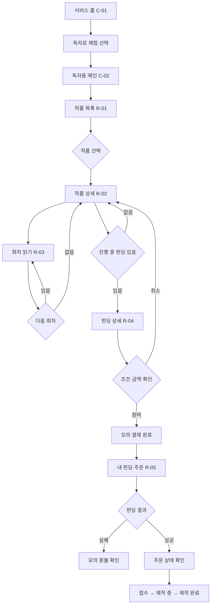
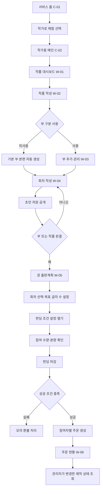
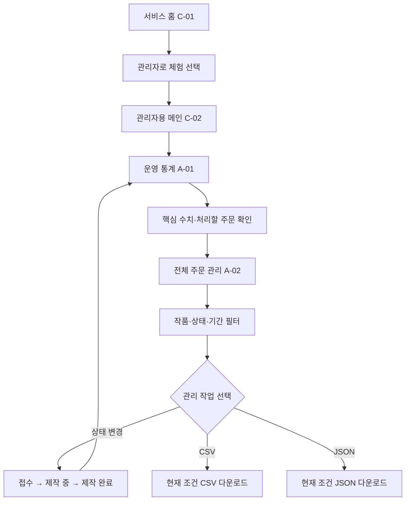

# 화면 정의서 및 사용자 흐름

> 페르소나와 사용자 요구사항을 기반으로 AI가 작성하고 사용자 검토를 반영한 화면 구현 기준안이다.

## 1. 화면 설계 원칙

- 독자 화면은 출퇴근 중 사용하는 20~30대 독자를 위해 모바일 우선으로 설계한다.
- 작가 화면은 작품·회차·펀딩을 한눈에 관리하도록 PC 화면을 우선하되 모바일에서도 깨지지 않게 한다.
- 내부 상태 코드는 그대로 노출하지 않고 `연재 중`, `부 완결`, `제작 중`처럼 쉬운 한국어로 표시한다.
- 펀딩 참여 전에 완결 조건, 한 권 예상 분량, 목표 수량, 금액, 기한과 환불 조건을 한 화면에서 보여준다.
- 부 구분을 사용하지 않는 작품은 기본 부 `본편`을 숨기고 회차만 표시한다.
- Bootstrap 5.3.8 공식 컴포넌트를 우선 사용하고 커스텀 CSS는 본문 가독성 보정에만 최소로 사용한다.
- 랜딩페이지는 별도로 두고 `독자 체험`, `작가 체험`, `관리자 체험` 중 하나를 선택하게 한다.
- 역할 선택 시 해당 시드 회원 ID와 역할을 세션에 저장하고 공통 메인 경로 `/main`으로 이동한다.
- 메인페이지는 하나의 `main.html`을 사용하되 세션 역할에 따라 메뉴와 본문을 독자·작가·관리자용으로 다르게 렌더링한다.
- 메인 이후의 작품·회차·펀딩·주문 등 기능 화면은 역할별 경로로 분리한다.
- 관리자 화면은 핵심 운영 수치와 처리할 주문을 PC에서 빠르게 확인하도록 설계한다.

## 2. 페르소나별 핵심 화면 요구

| 페르소나 | 핵심 요구 | 반영 화면 |
|---|---|---|
| W1 신인 작가 | 완결 동기를 주는 펀딩 현황 | W-01, W-05 |
| W2 독립 작가 | 인쇄·재고 없이 콘텐츠와 주문 현황 확인 | W-05, W-06 |
| W3 부 단위 장기 작가 | 부 사용 선택과 여러 권 분할 | W-02, W-03, W-05 |
| W4 완결작 보유 작가 | 기존 완결작의 수요 검증 | W-02, W-05 |
| W5 필명 작가 | 개인정보 대신 필명 중심 노출 | W-02, R-02 |
| R1 미완결에 신중한 독자 | 완결·환불 조건의 명확한 확인 | R-02, R-04, R-05 |
| R2 소장형 독자 | 포함 회차와 권 정보 확인 | R-02, R-04 |
| R3 예산형 독자 | 금액·기한·환불 상태 확인 | R-04, R-05 |
| R4 완결 후 몰아보는 독자 | 완결 필터와 읽기 편한 본문 | R-01, R-03 |
| R5 초기 후원 독자 | 펀딩 달성률과 주문 전환 확인 | R-04, R-05 |
| A1 서비스 운영자 | 핵심 통계, 전체 주문 처리와 자료 내보내기 | A-01, A-02 |

## 3. 전체 화면 목록

| ID | 역할 | 화면명 | 경로 | 핵심 목적 |
|---|---|---|---|---|
| C-01 | 공통 | 랜딩·역할 선택 | `/` | 서비스 설명과 독자·작가·관리자 체험 진입 |
| C-02 | 공통 | 역할별 메인 | `/main` | 동일 템플릿을 역할에 따라 다르게 렌더링 |
| R-01 | 독자 | 작품 목록 | `/novels` | 작품 탐색과 상태·펀딩 현황 비교 |
| R-02 | 독자 | 작품 상세 | `/novels/{novelId}` | 작품 소개, 부·회차, 출판 가능한 권 확인 |
| R-03 | 독자 | 회차 읽기 | `/episodes/{episodeId}` | 모바일 중심 웹소설 본문 열람 |
| R-04 | 독자 | 펀딩 상세·참여 | `/fundings/{campaignId}` | 조건 확인 후 모의 결제 참여 |
| R-05 | 독자 | 내 펀딩·주문 | `/reader/activities` | 환불·주문·제작 상태 확인 |
| W-01 | 작가 | 작품 대시보드 | `/writer/novels` | 내 작품과 진행 상태 요약 |
| W-02 | 작가 | 작품 작성·수정 | `/writer/novels/new`, `/writer/novels/{id}/edit` | 기본 정보와 부 사용 방식 설정 |
| W-03 | 작가 | 부·회차 관리 | `/writer/novels/{novelId}/contents` | 부와 회차 구조·상태 관리 |
| W-04 | 작가 | 회차 작성·수정 | `/writer/parts/{partId}/episodes/new`, `/writer/episodes/{id}/edit` | 본문 작성과 글자 수 확인 |
| W-05 | 작가 | 권·펀딩 관리 | `/writer/novels/{novelId}/publishing` | 권 분량 설정, 펀딩 생성·마감 |
| W-06 | 작가 | 주문 현황 | `/writer/orders` | 내 펀딩에서 생성된 주문 상태 조회 |
| A-01 | 관리자 | 운영 통계 | `/admin` | 서비스·펀딩·모의 결제·주문 핵심 수치 확인 |
| A-02 | 관리자 | 전체 주문 관리 | `/admin/orders` | 주문 조회·필터·상태 변경·파일 내보내기 |

## 4. 공통 화면

### C-01 랜딩·역할 선택

- 대상: 처음 방문한 독자·작가·관리자
- 핵심 문구: `완결을 기다린 독자와 끝까지 쓰는 작가를 위한 소장본 펀딩`
- 주요 구성
  - Navbar: 서비스명 `노벨킵`
  - Hero: 서비스 한 줄 설명
  - 역할 카드: `독자로 체험`, `작가로 체험`, `관리자로 체험`
  - 3단계 설명: 연재·열람 → 완결 조건부 펀딩 → 책 주문
  - 모의 기능 안내: 실제 결제·인쇄·배송이 없는 과제용 서비스
- 역할 선택 동작
  - 각 버튼은 `POST /experience/{role}`을 호출한다.
  - 서버는 역할에 맞는 시드 회원 ID와 역할을 세션에 저장한다.
  - 역할 선택 후 공통 메인 경로 `/main`으로 이동한다.
- 실제 로그인이나 보안 인증이 아닌 데모용 체험 기능임을 안내한다.
- Bootstrap: `navbar`, `container`, `row`, `card`, `btn`
- 빈 데이터여도 서비스 설명과 시드 데이터 생성 여부를 안내한다.

### C-02 역할별 메인

- 경로와 Thymeleaf 템플릿은 `/main`, `main.html` 하나로 유지한다.
- 독자에게는 작품 탐색과 내 펀딩·주문 메뉴를 표시한다.
- 작가에게는 내 작품·콘텐츠·출판 현황 메뉴를 표시한다.
- 관리자에게는 운영 통계와 전체 주문 관리 메뉴를 표시한다.
- 역할 전환은 랜딩페이지로 돌아가 다시 선택한다.

## 5. 독자 화면

### R-01 작품 목록

- 연결 페르소나: R1, R4, R5
- 주요 정보
  - 제목, 필명, 장르
  - 연재 중·완결 상태 배지
  - 최신 공개 회차
  - 진행 중 펀딩 달성률
- 주요 기능
  - 전체·연재 중·완결 필터
  - 작품 카드 클릭 → R-02
- Bootstrap: `card`, `badge`, `progress`, `btn-group`
- 예외 상태
  - 작품 없음: `아직 공개된 작품이 없습니다.`
  - 검색·고급 정렬은 이번 범위에서 제외한다.

### R-02 작품 상세

- 연결 페르소나: R1, R2, R4
- 상단 정보: 제목, 필명, 장르, 소개, 전체 상태
- 회차 구성
  - `MULTI`: 부별 Accordion 안에 회차 목록 표시
  - `SINGLE`: 부 이름 없이 회차 목록만 표시
- 출판 영역
  - 권 번호·제목, 포함 회차, 현재/목표 글자 수
  - 한 권 예상 분량 Progress
  - 진행 중 펀딩이 있으면 R-04 이동 버튼
- Bootstrap: `badge`, `accordion`, `list-group`, `progress`, `card`
- 예외 상태
  - 공개 회차 없음: `작가가 첫 회차를 준비 중입니다.`
  - 펀딩 없음: `아직 소장본 펀딩이 열리지 않았습니다.`

### R-03 회차 읽기

- 연결 페르소나: R1, R4
- 주요 구성
  - 작품명, 부 이름(사용할 때만), 회차 제목
  - 본문
  - 이전·목록·다음 회차 버튼
- UX 판단
  - 모바일에서 한 줄 길이가 지나치게 길지 않게 본문 최대 너비 제한
  - 넉넉한 줄 간격과 문단 여백 적용
  - 본문 외 요소는 최소화해 독서 집중
- Bootstrap: `container`, `breadcrumb`, `btn-group`
- 커스텀 CSS: 본문 최대 너비, 글자 크기, 줄 간격
- 예외 상태
  - 비공개·없는 회차: 404 안내 후 작품 상세 이동 버튼 제공

### R-04 펀딩 상세·참여

- 연결 페르소나: R1, R2, R3, R5
- 상단 요약
  - 권 제목과 포함 회차
  - 모의 판매가, 남은 기간
  - 현재 수량/목표 수량, 달성률
- 출판 조건 체크
  - 부 또는 작품 완결
  - 한 권 예상 분량 100% 이상
  - 펀딩 목표 수량
- 환불 안내
  - 조건 미충족 시 모의 환불
  - 실제 금액이 결제되지 않음을 명시
- 참여 영역
  - 수량 입력
  - 예상 금액 자동 계산
  - `모의 결제하고 참여하기`
  - 확인 Modal 후 제출
- Bootstrap: `progress`, `alert`, `form-control`, `modal`, `btn`
- 예외 상태
  - 중복 참여: 이미 참여했다는 Alert와 R-05 링크
  - 펀딩 종료: 참여 버튼 비활성화
  - 입력 오류: 수량 입력 아래 검증 문구

### R-05 내 펀딩·주문

- 연결 페르소나: R1, R3, R5
- 탭 구성
  - 참여 중: 모의 결제 완료, 펀딩 진행률
  - 환불: 실패 사유와 모의 환불 상태
  - 주문: 접수·제작 중·제작 완료
- 상태는 색상만 쓰지 않고 아이콘 없이 텍스트 배지로 함께 표시한다.
- Bootstrap: `nav-tabs`, `table-responsive`, `badge`, `progress`, `alert`
- 예외 상태: 내역 없음과 작품 목록 이동 버튼 제공

## 6. 작가 화면

### W-01 작품 대시보드

- 연결 페르소나: W1, W2, W4
- 작품별 정보
  - 제목, 전체 상태, 부 사용 방식
  - 공개 회차 수
  - 준비 중인 권과 펀딩 달성률
- 주요 동작
  - 새 작품 작성 → W-02
  - 작품 수정 → W-02
  - 콘텐츠 관리 → W-03
  - 출판 관리 → W-05
- Bootstrap: `card`, `badge`, `progress`, `dropdown`
- 빈 상태: 첫 작품 작성 방법과 생성 버튼 제공

### W-02 작품 작성·수정

- 연결 페르소나: W1, W3, W4, W5
- 입력 항목
  - 제목, 공개 필명, 장르, 소개
  - 부 구분: `사용하지 않음` / `1부·2부로 나눔`
  - 작품 상태
- 부 구분 안내
  - 미사용: 시스템이 기본 부 `본편`을 만들고 독자에게 숨김
  - 사용: 작가가 부 제목과 순서를 관리
- 변경 제한: 공개 회차·여러 부·펀딩이 있으면 부 방식 변경 불가
- Bootstrap: `form-control`, `form-select`, `form-check`, `alert`, `btn`
- 검증 오류는 각 입력 아래에 표시하고 기존 입력값을 유지한다.

### W-03 부·회차 관리

- 연결 페르소나: W1, W3
- `SINGLE`
  - 부 영역을 숨기고 회차 목록·추가 기능만 표시
- `MULTI`
  - 부별 Accordion
  - 부 추가·수정·완결 처리
  - 각 부 안에 회차 목록
- 회차 정보: 순서, 제목, 공개 상태, 글자 수
- 주요 동작: 회차 추가·수정, 초안 삭제, 공개
- Bootstrap: `accordion`, `list-group`, `badge`, `dropdown`, `modal`
- 빈 상태: 첫 회차 작성 버튼 제공

### W-04 회차 작성·수정

- 연결 페르소나: W1, W2, W3
- 입력 항목: 회차 번호, 제목, 일반 텍스트 본문
- 본문 아래 실시간 예상 글자 수 표시
- 저장 동작: 초안 저장 / 공개
- JavaScript는 화면 글자 수 안내만 담당하고 서버가 다시 계산한다.
- Bootstrap: `form-control`, `textarea`, `btn`, `alert`
- 저장 실패 시 본문을 유지하고 오류 메시지를 표시한다.

### W-05 권·펀딩 관리

- 연결 페르소나: W1, W2, W3, W4
- 권 출판계획
  - 부 선택
  - 권 번호·제목
  - 연속 회차 선택
  - 목표 글자 수
  - 현재 글자 수와 달성률
- 펀딩 설정
  - 목표 수량, 권당 모의 판매가, 시작·종료일
  - 초안 저장, 펀딩 열기, 펀딩 마감
- 마감 결과
  - 성공: 주문 생성 수 표시, W-06 이동
  - 실패: 실패 조건과 모의 환불 수 표시
- Bootstrap: `card`, `form-select`, `progress`, `badge`, `modal`, `alert`
- 조건 미충족 시 펀딩 마감은 가능하지만 실패 처리됨을 사전 안내한다.

### W-06 주문 현황

- 연결 페르소나: W2
- 정보: 주문 번호, 작품·권, 독자 닉네임, 수량, 주문 상태
- 작가는 자신의 펀딩에서 생성된 주문만 조회하며 상태를 변경하지 않는다.
- Bootstrap: `table-responsive`, `badge`, `alert`
- 실제 주소·송장·배송 정보는 표시하지 않는다.

## 7. 관리자 화면

### A-01 운영 통계

- 연결 페르소나: A1
- 핵심 지표 카드
  - 전체 작품 수와 공개 회차 수
  - 진행 중·성공·실패 펀딩 수
  - 모의 결제 금액과 모의 환불 금액
  - 접수·제작 중·제작 완료 주문 수
- 보조 정보
  - 펀딩 성공률
  - 최근 생성된 주문
  - 처리가 필요한 `접수` 주문
- 통계는 원본 데이터에서 조회 시점에 집계하며 별도 통계 테이블은 만들지 않는다.
- Bootstrap: `card`, `row`, `badge`, `progress`, `table-responsive`
- 예외 상태
  - 집계 데이터 없음: 모든 수치를 `0`으로 표시하고 시드 데이터 상태를 안내한다.
  - 통계 조회 실패: 오류 안내와 다시 시도 버튼을 제공한다.

### A-02 전체 주문 관리

- 연결 페르소나: A1
- 조회 정보: 주문 번호, 작품·권, 독자 닉네임, 수량, 주문일, 현재 상태
- 필터
  - 작품명
  - 주문 상태
  - 주문 시작일·종료일
- 주요 동작
  - 조회 조건 적용·초기화
  - 접수 → 제작 중 → 제작 완료 순차 상태 변경
  - 현재 조회 조건의 `CSV 다운로드`, `JSON 다운로드`
- 다운로드 경로
  - CSV: `GET /admin/orders/export.csv`
  - JSON: `GET /admin/orders/export.json`
  - 화면의 필터 Query Parameter를 동일하게 전달한다.
- 내보내기 항목에는 주문·작품·권·닉네임·수량·상태·주문일만 포함하고 민감정보는 포함하지 않는다.
- CSV는 한글이 깨지지 않도록 UTF-8 BOM으로 제공한다.
- Bootstrap: `form-control`, `form-select`, `table-responsive`, `badge`, `btn`, `modal`, `alert`
- 예외 상태
  - 조회 결과 없음: 필터 초기화 버튼 제공
  - 잘못된 상태 전이: 상태를 유지하고 이유 표시
  - 파일 생성 실패: 화면을 유지하고 오류 안내

## 8. 독자 사용자 흐름

## 9. 작가 사용자 흐름

## 10. 관리자 사용자 흐름

## 11. 반응형 기준

- 360px 이상 모바일 화면에서 가로 스크롤 없이 주요 독자 기능을 사용할 수 있어야 한다.
- 표는 모바일에서 `table-responsive`를 사용한다.
- 모바일에서는 버튼을 충분한 높이와 너비로 제공한다.
- 작가 관리 카드와 폼은 데스크톱에서 2열, 모바일에서 1열로 배치한다.
- 관리자 통계 카드는 데스크톱에서 여러 열, 모바일에서 1열로 배치하고 주문 표는 가로 스크롤을 허용한다.
- 웹소설 본문은 데스크톱에서도 최대 너비를 제한한다.

## 12. 공통 상태·오류 문구

| 상황 | 문구 예시 |
|---|---|
| 작품 없음 | 아직 공개된 작품이 없습니다. |
| 회차 없음 | 작가가 첫 회차를 준비 중입니다. |
| 펀딩 없음 | 아직 소장본 펀딩이 열리지 않았습니다. |
| 중복 참여 | 이미 이 펀딩에 참여했습니다. |
| 펀딩 실패 | 출판 조건을 충족하지 못해 모의 환불되었습니다. |
| 잘못된 상태 변경 | 현재 상태에서는 변경할 수 없습니다. |
| 역할 미선택 | 먼저 체험할 역할을 선택해 주세요. |
| 권한이 다른 화면 | 선택한 체험 역할에서는 이용할 수 없는 화면입니다. |
| 내보내기 실패 | 주문 파일을 만들지 못했습니다. 다시 시도해 주세요. |
| 입력 오류 | 입력 내용을 확인해 주세요. |
| 서버 오류 | 요청을 처리하지 못했습니다. 잠시 후 다시 시도해 주세요. |

## 13. 의도적으로 넣지 않은 화면

- 로그인·회원가입·비밀번호 찾기
- 실제 결제창·환불 신청
- 배송지·송장·배송 조회
- 댓글·좋아요·알림·추천
- PDF·책 미리보기

필수 사용자 흐름의 완성도를 우선하고 위 화면은 향후 확장으로 남긴다.
